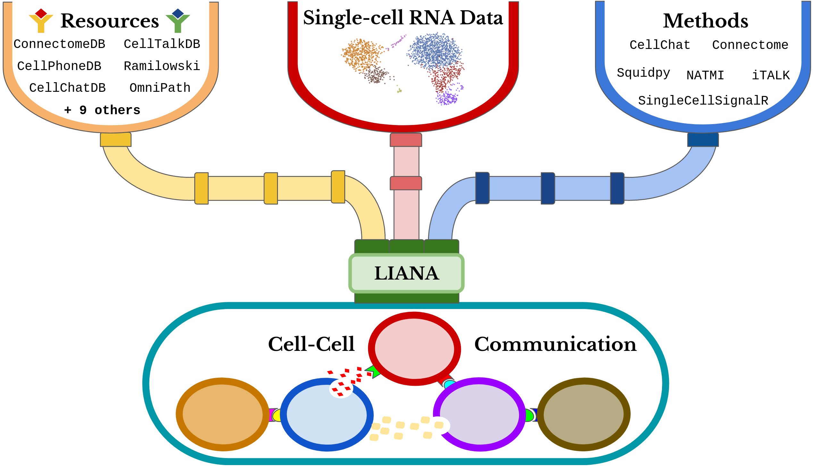

# Systematic Comparison of Cell-Cell Communication Tools and Resources

## LIANA Analysis Content

### I) Descriptive Resource Analysis
The code to reproduce the descriptive analysis of resources can be found at:
[analysis/resource_analysis](https://github.com/saezlab/ligrec_decouple/tree/main/analysis/comparison)

### II) Comparison of Methods and Resources
The code to reproduce the comparison between method-resource combinations can be found at:
[analysis/comparison](https://github.com/saezlab/ligrec_decouple/tree/main/analysis/comparison)

### III) Spatial Co-localization
The code to reproduce the co-localization analysis can be found at:
[analysis/spatial](https://github.com/saezlab/ligrec_decouple/tree/main/analysis/spatial)

### IV) Cytokine Signalling Agreement
The code to reproduce the cytokine activity (/w [CytoSig](https://sciwheel.com/work/#/items/11775454?collection=414754)) agreement analysis can be found at:
[analysis/cytosig](https://github.com/saezlab/ligrec_decouple/tree/main/analysis/cytosig)

### V) CITE-Seq Correlation/Specificity
The code to reproduce the Correlation/Specificity analysis of methods with CITE-Seq can be found at:
[analysis/citeseq](https://github.com/saezlab/ligrec_decouple/tree/main/analysis/citeseq)

### VI) Robustness
The code to reproduce the robustness analyses can be found at:
[analysis/robustness](https://github.com/saezlab/ligrec_decouple/tree/main/analysis/robustness)


## Environment set-up
# Clone repo
```{bash}
git clone https://github.com/saezlab/ligrec_decouple
```

```{r}
# install all required packages using *renv*
renv::restore()
```
Finally, make sure that [LIANA++](https://saezlab.github.io/liana/articles/liana_devel.html) is set up appropriately.


## [LIANA](https://github.com/saezlab/liana) framework
  

  
### Tools

The Scoring Functions included in this comparison are:

- CellPhoneDB algorithm (via [Squidpy](https://squidpy.readthedocs.io/en/latest/))
- CellChat
- NATMI
- Connectome
- SingleCellSignalR (SCA)
- LogFC Mean (inspired by iTALK)
  
  
### Resources

The following CCC resources are accessible via this pipeline:

- CellChatDB
- CellPhoneDB
- Ramilowski2015
- Baccin2019
- LRdb
- Kiroauc2010
- ICELLNET
- iTALK
- EMBRACE
- HPMR
- Guide2Pharma
- connectomeDB2020
- talklr
- CellTalkDB
- OmniPath
  
  
### OmniPath
  
All the resources above are retrieved from [OmniPath](https://omnipathdb.org/),
and more specifically [OmnipathR](https://github.com/saezlab/OmnipathR).
However, individual resources retrieved from the OmniPath web service are not to be
affected by this, as each resource expected to be identical to its original form, apart from minor processing imperfections.
  
`OmniPath` itself serves as a composite CCC resource combining all the ones listed
above + [more](https://doi.org/10.15252/msb.20209923). `OmniPath` also collects
further information about the roles and localisation of proteins in intercellular communication.
We made use of this information regarding the and by default the `OmniPath`CCC
resource in LIANA is filtered according to the consensus localisation and curation of
ligand-receptor interactions. To obtain more information how we filtered the default CCC `OmniPath`,
as well as to explore custom filter options see [customizing OmniPath resources](https://saezlab.github.io/liana/articles/liana_custom_op.html). 

